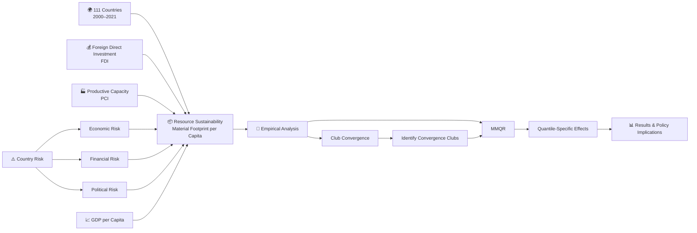
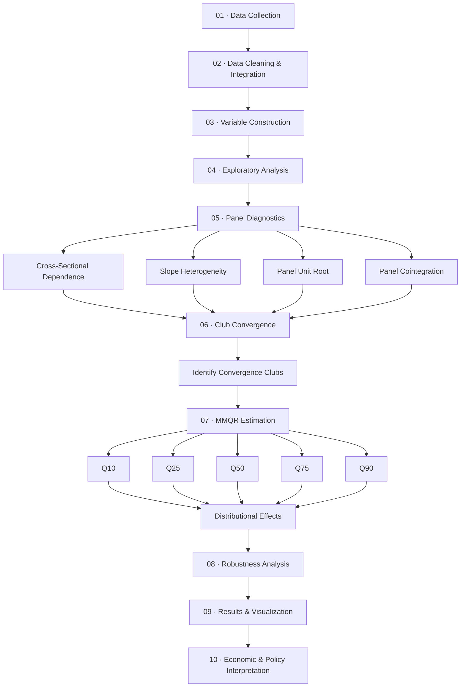
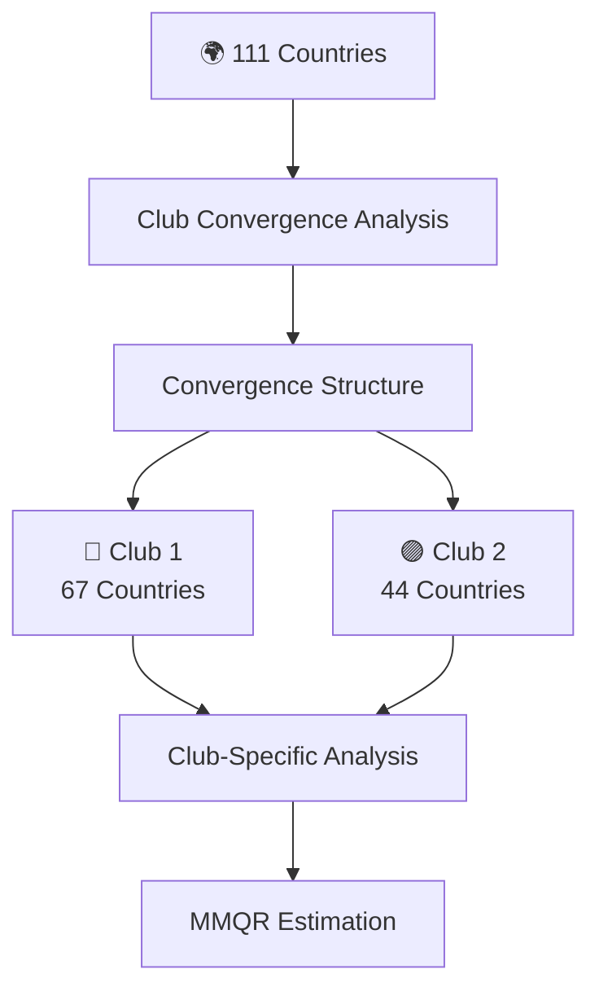
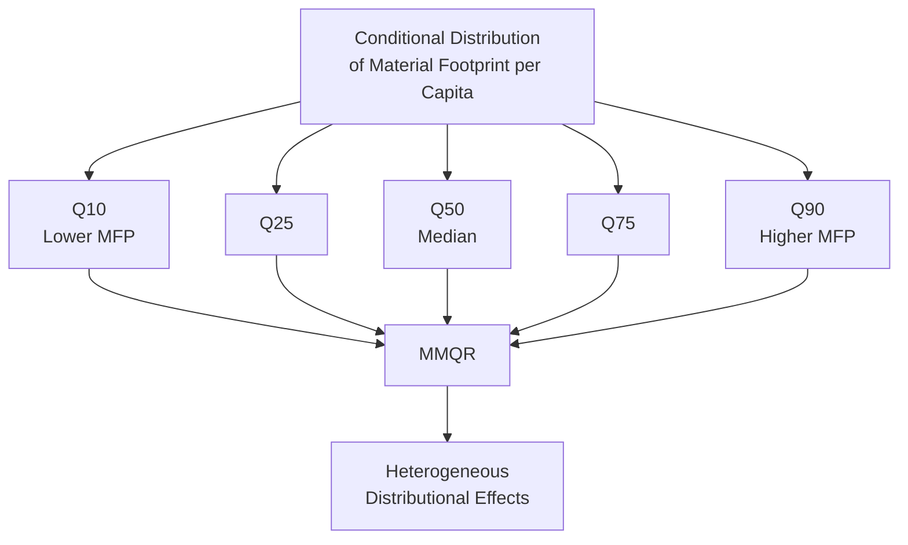
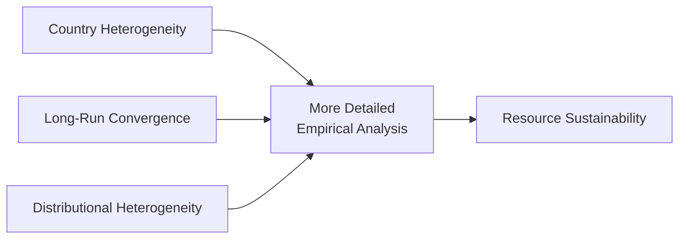
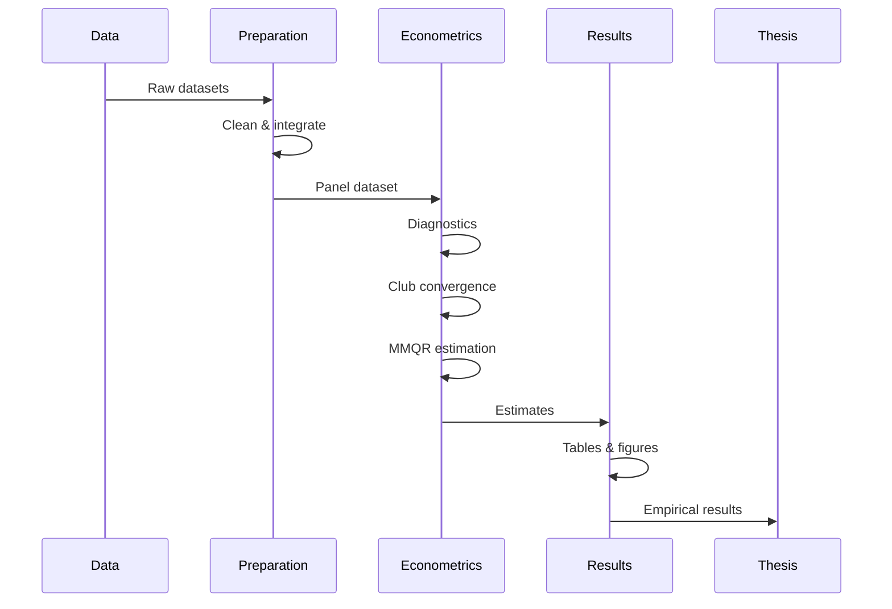

# The Impact of Economic Risk, Financial Risk, and Political Risk on Resource Sustainability  
### Method of Moments Quantile Regression and Club Convergence

<p align="center">
  <em></em><br>
  <em>Thesis Title</em><br>
  <em>Investigating the Impact of Foreign Direct Investment and Productive Capacity on Resource Sustainability</em><br>
</p>

<p align="center">


</p>

---

## 📖 About the Thesis

This repository contains the research materials, empirical analysis, methodology, and thesis document for an **M.Sc. thesis in Economics** investigating the relationship between **Foreign Direct Investment**, **Productive Capacity**, **Economic Risk**, **Financial Risk**, **Political Risk**, and **Resource Sustainability**.

The empirical study examines **111 countries over the period 2000–2021** and focuses on whether economic activity and investment contribute to or undermine resource sustainability.

Rather than estimating only an average relationship across countries, the study combines two complementary approaches:

> **Club Convergence** identifies groups of countries that exhibit similar long-run patterns of resource sustainability, while **Method of Moments Quantile Regression (MMQR)** estimates heterogeneous effects across different levels of resource consumption.

The analysis incorporates:

- Foreign Direct Investment (**FDI**)
- Productive Capacity (**PCI**)
- Economic Risk (**ER**)
- Financial Risk (**FR**)
- Political Risk (**PR**)
- Gross Domestic Product per capita (**GDP**)
- Material Footprint per capita (**MFP**)

---

# 🎯 Research Question

The central research problem can be summarized as:

> **How do Foreign Direct Investment and Productive Capacity affect Resource Sustainability, and do these effects differ across countries with different levels of resource consumption and risk?**

The study addresses this by combining **cross-country heterogeneity**, **convergence behavior**, and **distributional econometric analysis**.

---

## 🎓 Thesis Information

| | |
| **Author** | Amin Mirhaj |
| **Degree** | M.Sc. in Economics |
| **University** | Ferdowsi University of Mashhad |
| **Supervisor** | Dr. Narges Salehnia |
| **Advisor** | Dr. Fariba Osmani |
| **Published Year** | 2024 |

### 📄 Full Thesis

**[View Full Thesis →](./thesis/thesis.pdf)**

---

# 🗂️ Repository Structure

```text
master-thesis-quantitative-econometrics/
│
├── 📄 README.md
│
├── 📚 thesis/
│   └── thesis.pdf
│
├── 📊 data/
│   ├── raw/
│   ├── processed/
│   └── README.md
│
├── 💻 code/
│   ├── python/
│   └── stata/
│
├── 📓 notebooks/
│   ├── 01_data_preparation.ipynb
│   ├── 02_eda.ipynb
│   ├── 03_club_convergence.ipynb
│   ├── 04_panel_diagnostics.ipynb
│   ├── 05_mmqr.ipynb
│   └── 06_results_visualization.ipynb
│
├── 📈 results/
│   ├── tables/
│   └── figures/
│
└── 📑 docs/
    ├── data_sources.md
    ├── methodology.md
    └── variable_dictionary.md
```

---

# 🧭 Research at a Glance



---

# 🔬 Research Methodology

The empirical workflow follows a sequential design:



---

# 🌍 Method 1 — Club Convergence

A key feature of the research is the use of **Club Convergence**.

Instead of assuming that all 111 countries follow the same long-run trajectory, countries are grouped according to their convergence behavior in resource sustainability.



### Identified structure

| Convergence Club | Number of Countries |
|---|---:|
| **Club 1** | 67 |
| **Club 2** | 44 |
| **Total** | **111** |

The resulting clubs are then analyzed separately in order to capture differences in the underlying country groups.

---

# 📐 Method 2 — Method of Moments Quantile Regression

The main econometric technique is **Method of Moments Quantile Regression (MMQR)**.

Unlike conventional mean regression, MMQR allows the analysis to examine relationships at different points of the conditional distribution of Material Footprint per capita.



### Quantiles examined

**Q10 · Q25 · Q50 · Q75 · Q90**

This allows the research to ask a more detailed question:

> Do FDI, productive capacity, risk, and GDP have the same relationship with resource consumption across the distribution?

---

# 📈 What Makes the Empirical Strategy Different?

The research combines **three dimensions of heterogeneity**:



### 1. Country heterogeneity

Countries are not assumed to behave identically.

### 2. Convergence heterogeneity

Countries are grouped into convergence clubs based on their long-run resource-sustainability patterns.

### 3. Distributional heterogeneity

MMQR evaluates effects at different quantiles rather than only estimating an average effect.

Together, these approaches provide a more granular empirical framework for studying resource sustainability.

---

# 🔬 Reproducibility Workflow

The intended workflow for reproducing the empirical analysis is:



---

# 🗃️ Data Sources

The thesis integrates information from several major databases:

| Source | Main Contribution |
|---|---|
| **Global Material Flows Database (GMFD)** | Material Footprint |
| **UNCTAD** | Foreign Direct Investment / Productive Capacity |
| **International Country Risk Guide (ICRG)** | Country Risk |
| **World Development Indicators (WDI)** | GDP and macroeconomic indicators |

---

# 📝 Methodological Summary

| Stage | Method / Component | Purpose |
|---|---|---|
| **1** | Data collection | Construct the country-level panel |
| **2** | Data cleaning & integration | Prepare consistent empirical data |
| **3** | Variable construction | Define MFP, FDI, PCI, risk variables and GDP |
| **4** | Exploratory analysis | Understand the data |
| **5** | Panel diagnostics | Assess dependence, heterogeneity, stationarity and long-run relationships |
| **6** | Club Convergence | Identify groups with similar long-run patterns |
| **7** | MMQR | Estimate heterogeneous distributional effects |
| **8** | Robustness analysis | Assess the stability of findings |
| **9** | Visualization | Present empirical evidence |
| **10** | Interpretation | Derive economic and policy implications |

---

# 🔑 Keywords

`Resource Sustainability` · `Foreign Direct Investment` · `Productive Capacity` · `Economic Risk` · `Financial Risk` · `Political Risk` · `Panel Data` · `Club Convergence` · `Method of Moments Quantile Regression`

---

# 📄 Citation

For users of this repository or thesis, the recommended reference is:

```text
Suggested citation:
Mirhaj, A. (2024). Investigating the Impact of Foreign Direct Investment and Productive Capacity on Resource Sustainability: Method of Moments Quantile Regression and Club Convergence (M.Sc. thesis). Ferdowsi University of Mashhad.
```

---

<p align="center">
  <strong>https://github.com/aminmirhaj/master-thesis-quantitative-econometrics</strong>
</p>

<p align="center">
  <a href="./thesis/thesis.pdf">📄 Read the Full Thesis</a>
</p>